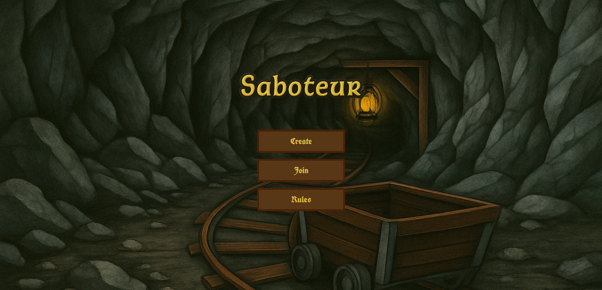
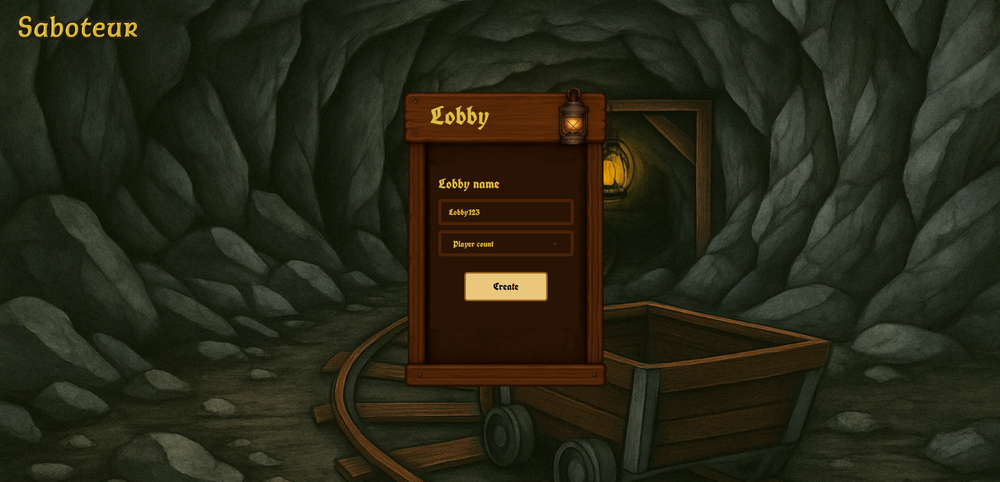
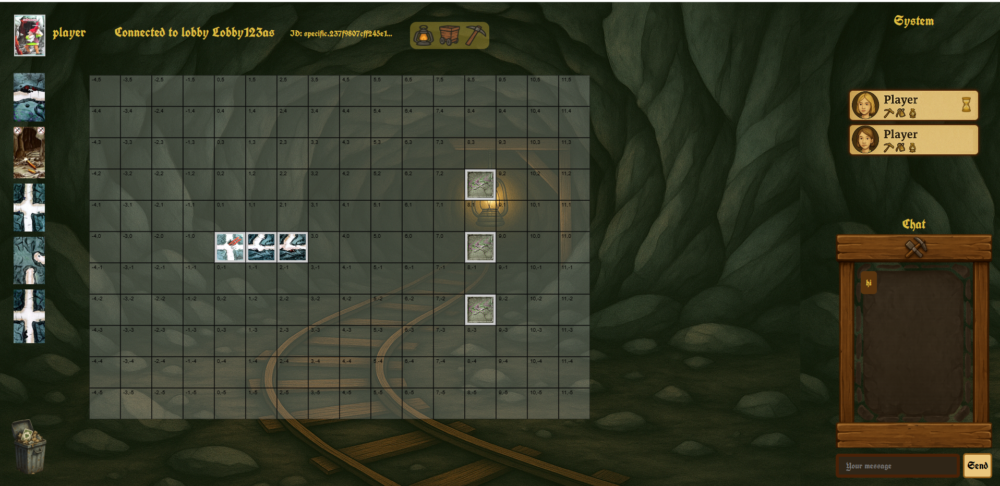
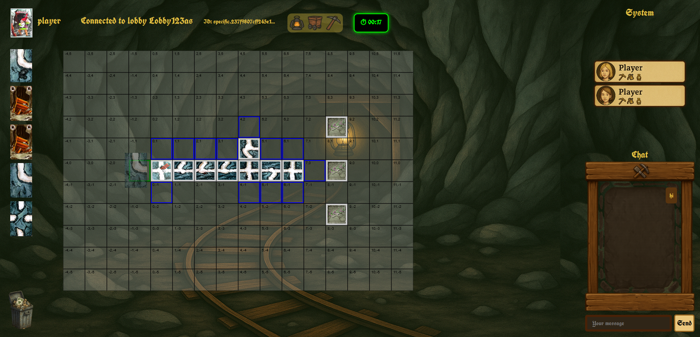
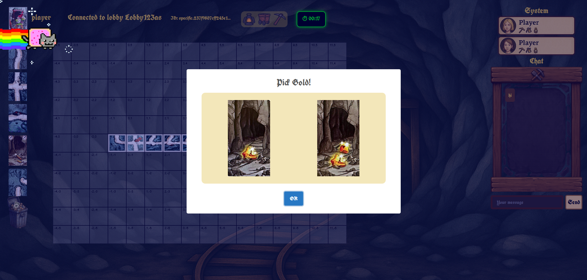

# Saboteur Frontend

Frontend implementation of the **Saboteur** multiplayer board game.

The client communicates with the backend through **REST APIs** and **WebSockets**, providing a responsive real-time multiplayer experience.

---

## Features

- Multiplayer game interface
- Interactive game board
- Real-time updates via WebSocket
- Lobby system
- Turn-based gameplay
- Live synchronization with the backend
- Responsive interface

---

## Tech Stack

- HTML5
- CSS3
- JavaScript (ES6)
- WebSocket API
- Fetch API

---

## Architecture

```text
Browser
    │
    ├── REST API
    └── WebSocket
            │
            ▼
    Saboteur Backend
(Django + Channels + Redis)
```

---

## Project Structure

```
client/
│
├── css/
│
├── img/
│
├── js/
│   ├── api.js
│   ├── websocket.js
│   ├── game.js
│   ├── lobby.js
│   └── ...
│
├── create.html
├── lobby.html
├── game.html
└── index.html
```

---

## Running

The frontend is designed to work with the Saboteur Backend.

Start the backend first.

---

## Screenshots

### Home

/

### Lobby

/

### Gameplay

/
/
/

---

## Related Project

Backend Repository:

   https://github.com/Boyazid228/saboteur_api

---

## Future Improvements

- Better animations
- Mobile support
- Dark mode
- Spectator mode
- Sound effects
- Chat system
- Game replay

---
